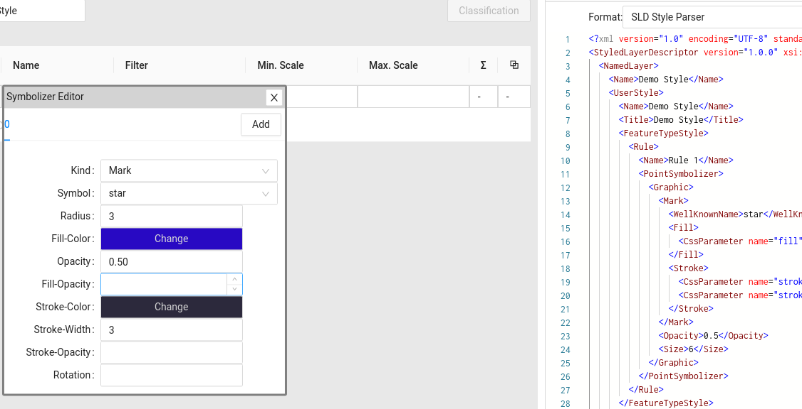

# Map styles {#styles}

Styles define how GeoServer renders spatial data to maps.
The GeoServer render engine uses SLD, but other styling languages such as (Geo)CSS are supported via extensions.
The styling extensions work functionally the same — they convert style definitions written in another syntax to SLD that the render engine can use.

A more novel approach to styling is distributing map styles to clients.
This is especially useful when distributing vector data — either through WFS or WMTS (vector tiles).
Distributing map styles along with spatial vector data lets client software render the data in a meaningful way.
This lowers the barrier for consuming vector data, as clients don't have to "know" anything about the data or its properties to render it.

## Choosing a style format

One of the main issues with distributing map styles is the lack of globally used standards.
Many formats have been developed for storing style information, and it seems nearly every software uses its own implementation.
While the SLD standard is commonly supported, it's very flexible and allows vendor-options and other extensions that cause incompatibilities between software.
In practice, this often means styles that are created in QGIS and exported to SLD may not work in GeoServer, despite using a common style definition language.

:::{.note-box}
**Note:** while the SLD produced by QGIS is not guaranteed to be consumable by GeoServer, progress in ensuring compatibility has been made over the recent years.
Most issues arise from the use of special QGIS rendering options, such as shapeburst symbologies, and more complex styles suc as expression based symbology.
See the [GeoServer documentation](https://docs.geoserver.org/master/en/user/styling/qgis/index.html) for more information on converting QGIS SLD to GeoServer.
:::

Selecting a suitable style format for distribution therefore requires some knowledge of the (intended) client software.
If you are planning to use GeoServer as a backend for your mobile application written in MapBox GL, it makes sense to utilise the [MBStyles extension](https://docs.geoserver.org/master/en/user/styling/mbstyle/index.html).

On the other hand, if you want to stick to SLD and ensure maximum compatibility between software, consider installing the [GeoStyler Extension](https://docs.geoserver.org/master/en/user/community/geostyler/index.html).
The extension adds a new graphical style editor tab to the GeoServer style editor, allowing users to generate GeoServer-compatible SLD with relative ease.
Try playing around with creating styles for your data in GeoStyler on the [GeoStyler demo page](https://geostyler.github.io/geostyler-demo/).

