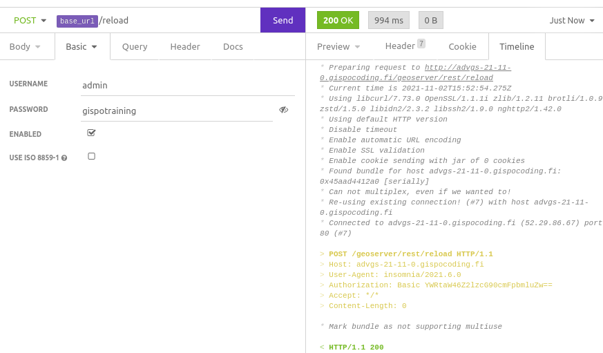
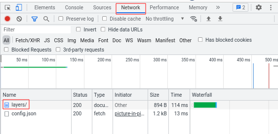

# GeoServer REST API {#rest}

The GeoServer REST API can be used to perform the same actions that are available in the GeoServer web UI.
The [GeoServer documentation](https://docs.geoserver.org/stable/en/user/rest/index.html) is a good resource for getting started with using the REST API.

It's useful to know some basic REST principles before getting started.
REST, short for Representational state transfer, is a software architecture style especially common on the internet.
REST APIs are commonly used for creating, reading, updating, or deleting pieces of content, called *resources*.

RESTful APIs are commonly called by making requests using **HTTP methods** such as GET, POST, and DELETE.
These requests may contain a data payload called a **body**, which is typically in JSON format.
Additional **headers** may also be included to provide further information to the server, such as user authentication or the preferred response format.
Requests are made to specific URLs/routes, called service **endpoints**.

Based on the endpoint, HTTP method, body, and headers, the server processes the request and returns a response.
Responses have a HTTP status code indicating the status of the response, see the list of [HTTP status codes](https://en.wikipedia.org/wiki/List_of_HTTP_status_codes).
There may also be a data payload, such as an error message, which is again typically in JSON format.

The GeoServer REST API of the training machines can be accessed on `http://<base-url>/geoserver/rest`.
The `geoserver/rest` endpoint is often called the *base URL* of the GeoServer REST API.

## Using APIs

Many tools exist for calling REST APIs.
Two popular GUI tools are [Postman](https://www.postman.com/) and [Insomnia](https://insomnia.rest/).
Both allow users to generate and send requests to the GS REST API.
These tools can also import OpenAPI definitions to show available paths and schemas.

There's also various options to call the GS REST API programmatically.
These include the command-line tool curl, that's not as intuitive to use compared to tools like Insomnia, but is widely available on Linux systems and can be easily used in scripts.
Many text editors and IDEs such as Visual Studio Code and IntelliJ IDEA support defining and making API calls in `.rest` files.
The GS API can also be called from various programming languages.

## Exercise — REST API

The examples in this exercise are based on [Insomnia](https://insomnia.rest), a free tool for designing and testing APIs that can be [installed](https://docs.insomnia.rest/insomnia/install) on most operating systems.
While installing Insomnia is not strictly required to complete the exercise, it's a highly useful tool especially for those unfamiliar with REST APIs.
If using Insomnia, start by creating a new Request Collection called gs-training from the Create button in the top-right corner of the dashboard window.
Then edit the base configuration with the keyboard shortcut `Ctrl + E` (or clicking No environment → Manage environments near the top-left corner) and fill in the following:

```
{
  "base_url": "http://<base-url>/geoserver/rest"
}
```

Replacing `<base-url>` with the URL of your training machine.
Click done.
Create a new request (`Ctrl + N` or right-click the left panel → New request).
Set the HTTP method type and request name as desired.
You can use `base_url` as a *variable* in your HTTP requests by typing `{{ base_url }}` in the URL field.
For example, to call `http://<base-url>/geoserver/rest/layers` simply type `{{ base_url }}/layers`.

:::{.hint-box}
**Hint:** GeoServer supports Basic authentication.
In Insomnia, authentication details can be provided on the Auth tab.
:::

One of the most common use cases for the REST API, especially when running a passive cluster, is triggering a catalog reload when the contents of the GS data directory change.
While the implementation details differ based on programming language, the API call is always the same.
Read the [/reload endpoint documentation](https://docs.geoserver.org/latest/en/api/#1.0.0/reload.yaml) and the relevant [GeoServer documentation article](https://docs.geoserver.org/master/en/user/rest/api/reload.html) for details.

Try triggering a catalog reload using the API.
If using Insomnia, create a new request first.
What response do you get, and what does it mean?
Try until you get a successful result (HTTP return code 200).



You can also make GET requests in your web browser.
Open a new Incognito window in your browser and try opening `http://<base-url>/geoserver/rest/layers`.
You are likely prompted for credentials, **click cancel**.
What result do you see, and why?

Next, in the same incognito window, open the GS web interface at `http://<base-url>/geoserver/web/` and log in using your credentials.
Then try opening `http://<base-url>/geoserver/rest/layers` again.

:::{.hint-box}
**Hint:** you can use the developer tools panel to inspect HTTP requests made by your browser.
In Chrome, open the developer tools panel by hitting F12.
Click on the Network tab and reload the page with F5.

You can then see and examine the requests made by the browser.


:::
